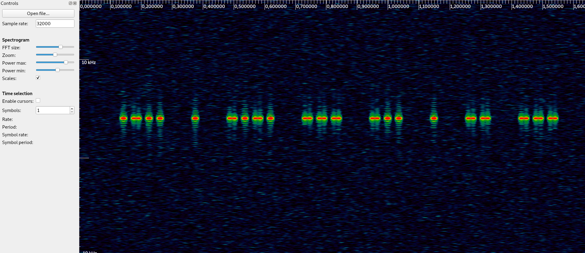

# Write-Ups for the FCSC 2021


## Write-Up - B.A. BA


### Challenge discovery

 

We are presented an iq radio capture with a sample rate of 200 kHz.


Opening it with **inspectrum** gives the following output:





It seems like Morse is transmitted in the capture. But there are a lot of characters to translate !


The first characters are:


```
-_-- - _-_- ___ _-- - __ ___ -_- --- - -- _- _ - -_- _- -_ _ -- ___ _- -_ -_-- ___ --_ -_-- -_ -_-- -__- ---- -_ _--- - _ __

-_-- - _-_- ___ _-- - __ ___ -_- --- - -- -_ _ - -_- _- -_ _ -- ___ -_ _- -_-- ___ --_ -_-- -_ -_-- -__- ---- -_ _--- - _ __
```


Translating the first characters gives the following output :

```
LECODEMORSEINTERNATIONALOULALPHABETM
```


It is the first paragraph of the Wikipedia page for Morse code (https://fr.wikipedia.org/wiki/Code_Morse_international).

I skipped thus the beginning of the capture and, farther, I came across this part:

```
 - _---- ___-- ____- -____ _-_- ___-- _--- _--- ___-- _-_- _-_- --_- - ____- ----- -_ __--- _---- __--- ----_ ----- __--- --_- ---__ -_ -____ _--- __--- ---__ ___-- _---- -____ ____- --___ ___-- -_ _____ _____ --___ _-_- ----- _____ ____- ----_ __--- _---- --___ _-- ----- ___-- _____ _-_- _-- __--- _--- _-_- ----_ -_ -____ ----- _-_- _---- ----_ --- _ ___ -__- -- _- ---_ - _- _ - - _- -____ ___-- ---__ --___ -__-
```


Morse symbols are 5 characters long, which tend to be numbers. As we know the flag is a SHA256 sum, it is highly probable that we get here the flag !

Translated, it turns into :


```
E6891C8BB8CCFE95A767457F3A1B73861928A002C5094762D580CD7BC4A15C64STOPINVENTEEN1832P
```


(Actually I started the translation a bit before this part to be sure it is the right place)

So the flag is **FCSC{E6891C8BB8CCFE95A767457F3A1B73861928A002C5094762D580CD7BC4A15C64}**
