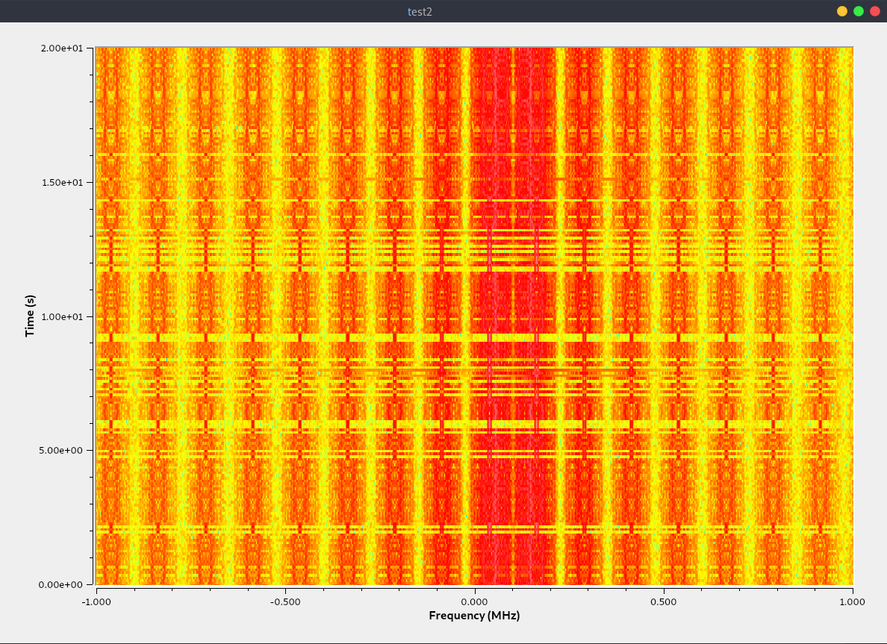
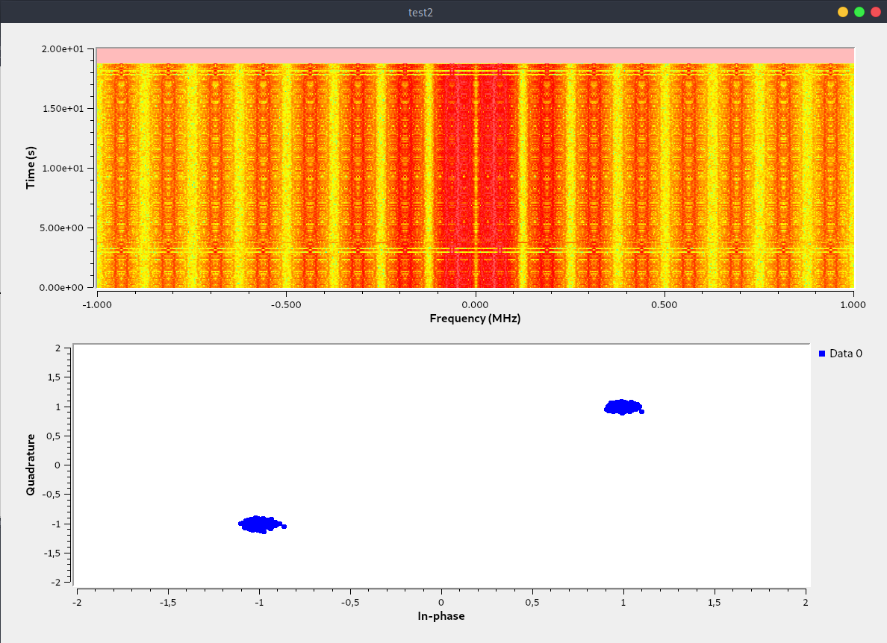
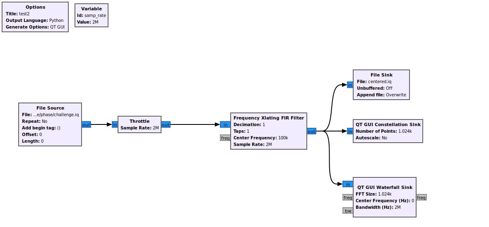
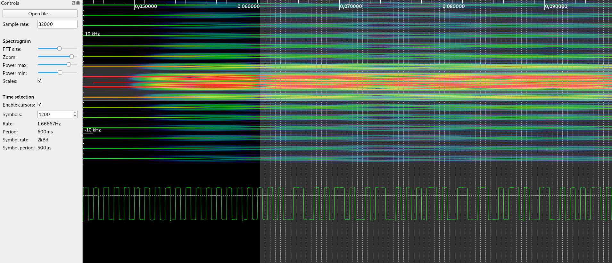

# Write-Ups for the FCSC 2021

## Write-Up - Phase à phase

### Challenge discovery

We are presented an iq radio capture with a sample rate of 2 MHz.

The capture is very small, so, to have a good view of with with GNU Radio, I had to loop the capture. Here is its waterfall:

 

We observe that the signal is shifted by 100 kHz. A simple Xlating filter can center the signal to have the right constellation appear.

The two points of the BPSK constellation do appear well. We can export this signal to open it with **inspectrum**. Here is the diagram of the **GRC** program used:

 

Once the signal is recentered, it is possible to open it with Inspectrum to add a phase demodulation and extract the symbols with a cursor:

The statement gives the clue that a Manchester code is used to transmit the data. To decode it, where is the algorithm:

Take the symbols in pair (0-1, 2-3, 4-5,...). 

- If the first is > 0 and the 2nd is < 0, then you have a 1
- If the first is < 0 and the 2nd is > 0, then you have a 0

Be careful to start the symbols extraction to have, first, symbols decoded to 1 (if not, the algorithm will not managed to decode correctly the symbols).

I wrote the script **script.py** to get it. Once decoded, the flag appears:

**FCSC{9ab3c6bcdb9a5002c9fec155ff5d9fd29927bdc458511cee0ffbcd7e0a895d38**

  
