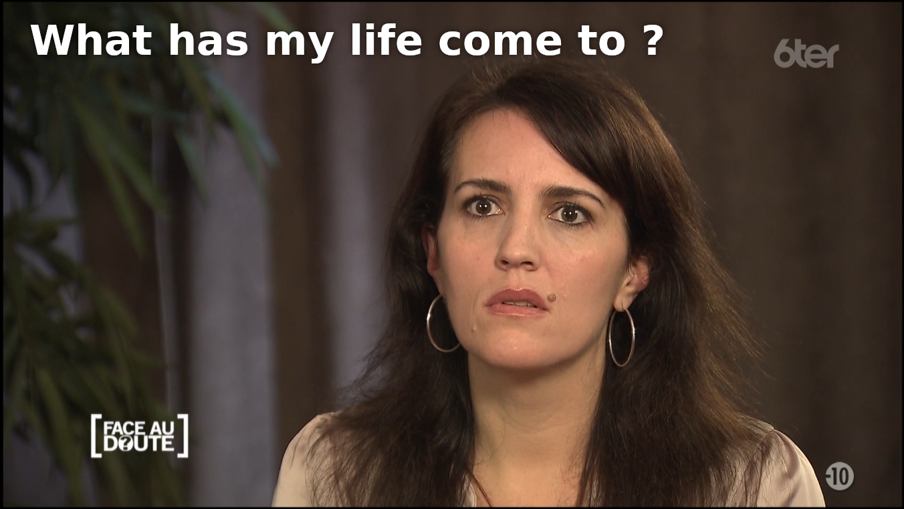
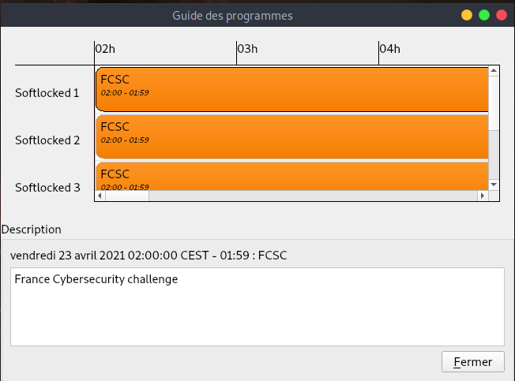
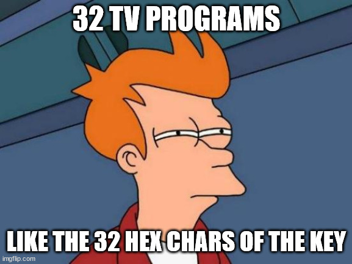
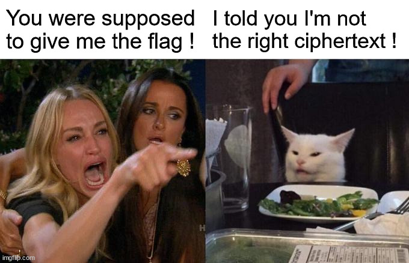

# Write-Ups for the FCSC 2021

## Write-Up - Smart TV Locker


### Challenge discovery

This was the second hard challenge I solved this edition. We are presented a radio capture of transmissions to a smart TV. Apparently, the TV has been infected with a terrible malware blocking it.

The file challenge.ts is the capture, in MPEG-2 TS format.

The aim is thus to know what attack was performed and what means was used for it. 

### Information gathering

My first attempt was to inject it in a GNURadio demodulator (I spent to much time on it for other challenges...). However, after a couple of minutes dying in front of the complex diagrams displayed in Google for MPEG-2 TS reading, I changed my mind and saw that the capture could simply be played in VLC. That is where I questioned my existence.

By doing this, I could watch a wonderful extract of the series *Face au doute*. There is a small bug in the middle, probably due to the malware injection...





By looking up a bit on Google, I learned that it is indeed possible to perform attacks on smart TV based on DVB-T signals. especially one, named Scheel's attack, allows an attacker to send a web page that will be displayed on the victim's TV.
https://www.bleepingcomputer.com/news/security/about-90-percent-of-smart-tvs-vulnerable-to-remote-hacking-via-rogue-tv-signals/

I also analyzed a bit the capture with the **strings** and **binwalk** commands. I came across zlib parts that, once inflated, contained the following data:

```
00000000: 4249 4f50 0100 0000 0000 0128 0400 0000  BIOP.......(....
00000010: 0000 0000 0473 7267 0000 0000 0000 0114  .....srg........
00000020: 0003 010c 6c6f 636b 6572 2e68 746d 6c00  ....locker.html.
00000030: 0466 696c 0001 0000 0004 6669 6c00 0000  .fil......fil...
00000040: 0001 4953 4f06 0000 002b 0002 4953 4f50  ..ISO....+..ISOP
00000050: 0d00 0000 f700 0201 0004 0000 0001 4953  ..............IS
00000060: 4f40 1201 0000 0016 0247 0a00 0180 0100  O@.......G......
00000070: 03ff ffff ff00 0800 0000 0000 0024 2e01  .............$..
00000080: 0772 6334 2e6a 7300 0466 696c 0001 0000  .rc4.js..fil....
00000090: 0004 6669 6c00 0000 0001 4953 4f06 0000  ..fil.....ISO...
000000a0: 002b 0002 4953 4f50 0d00 0000 f700 0201  .+..ISOP........
000000b0: 0004 0000 0002 4953 4f40 1201 0000 0016  ......ISO@......
000000c0: 0247 0a00 0180 0100 03ff ffff ff00 0800  .G..............
000000d0: 0000 0000 0013 0c01 0c76 6963 746f 7279  .........victory
000000e0: 2e70 6e67 0004 6669 6c00 0100 0000 0466  .png..fil......f
000000f0: 696c 0000 0000 0149 534f 0600 0000 2b00  il.....ISO....+.
00000100: 0249 534f 500d 0000 00f7 0003 0100 0400  .ISOP...........
00000110: 0000 0349 534f 4012 0100 0000 1602 470a  ...ISO@.......G.
00000120: 0001 8001 0003 ffff ffff 0008 0000 0000  ................
00000130: 0001 1837
```

2 pieces of information could be retrieved:

1. The header BIOP is present. By searching it on Google, I found this paper https://dvb.org/wp-content/uploads/2019/12/a137_hybrid_broadcast_broadband_signalling.pdf that informs about the data carousel structure used to transport generic data inside DVB signals.
2. File names are present: **locker.html**, **rc4.js** and **victory.png**, meaning a web application has been presumably uploaded, confirming the Scheel's attack.

### Data recovery

I discovered some tools useful for demultiplexing MPEG2 TS captures. **demuxfs** (https://github.com/lucasvr/demuxfs) did work very well. It turns the multiple streams into a file system, where each type of stream is separated in a different folder.

```bash
demuxfs -o backend=filesrc -o filesrc=challenge.ts ./mnt
```

I wasted time wondering why the folder DSM-CC, which was supposed to implement data and object carousels, was empty. However, after digging a bit the exploration, I found that, under the PAT folder, which is normally the table identifying the programs being broadcasted, **DataCarrousselStreams** folders are present, with symbolic links pointing to the DDB folder. Inside it are located 5 stream folders, each one containing 3 zlib files, which are the only ones present in the streams.


```
find -type f -exec file {} \; | grep -i zlib
./DDB/0x501/Version_1/module_02/block_00.bin: zlib compressed data
./DDB/0x501/Version_1/module_03/block_00.bin: zlib compressed data
./DDB/0x501/Version_1/module_01/block_00.bin: zlib compressed data
./DDB/0x101/Version_1/module_02/block_00.bin: zlib compressed data
./DDB/0x101/Version_1/module_03/block_00.bin: zlib compressed data
./DDB/0x101/Version_1/module_01/block_00.bin: zlib compressed data
./DDB/0x201/Version_1/module_02/block_00.bin: zlib compressed data
./DDB/0x201/Version_1/module_03/block_00.bin: zlib compressed data
./DDB/0x201/Version_1/module_01/block_00.bin: zlib compressed data
./DDB/0x301/Version_1/module_02/block_00.bin: zlib compressed data
./DDB/0x301/Version_1/module_03/block_00.bin: zlib compressed data
./DDB/0x301/Version_1/module_01/block_00.bin: zlib compressed data
./DDB/0x401/Version_1/module_02/block_00.bin: zlib compressed data
./DDB/0x401/Version_1/module_03/block_00.bin: zlib compressed data
./DDB/0x401/Version_1/module_01/block_00.bin: zlib compressed data
```


I copied them inside another folder (as the mounted partition is readonly), uncompressed them and looked at their content.


Surprise ! The first one looks like an HTML file (prepended by a BIOP header).

By opening them all, I deduced that each of the 5 stream folders contain the 3 same files:
1. A concatenation of the locker.html and the rc4.js files
2. The victory.png file
3. The details of the web application (with the list of the other files)


### Analyzing the web application

The next step was to understand how the web application works. 

Here is the interesting part of locker.html:


```html
<script>
function hash(str) {
    var h = 0;
    for (i in str) {
        var c = str.charCodeAt(i)
        h = ((h << 8) ^ (h >> 8) ^ c) & 0xffff
    }
    return h;
};
 // [...] Skip part
function verify(input) {
    var vb = document.getElementById("oipfBroadcast");
    vb.bindToCurrentChannel();
    var all_programmes = vb.programmes;
    var key = ["", "", "", "", "", "", "", "", "", "", "", "", "", "", "", "", "", "", "", "", "", "", "", "", "", "", "", "", "", "", "", ""];
    for (var i = 0; i < all_programmes.length; i++) {
        current_prog = all_programmes[i]
        name_hash = hash(current_prog.name);
        if (name_hash == 37) {
            key[15] = current_prog.longDescription;
        }
        // [...] This part is given in annex 2 (list.txt)
    }
    input = binDecode(input);
    key = hexDecode(key.join(""));
    check = enc(key, input);

    if (check == hexDecode("00112233445566778899aabbccddeeff")) {
        ciphertext = hexDecode("1c8fe6416ae2c7f40fad06e7d410aec734c23a96748a8aba9d7c2d5cac12d326aa1105e4820a1bbda27426a4557caebb97cff12c534c680284aceefff9b69c28ee0165394ec0aca77cc6364fc546c0072ff80480aba6ecb859f5ec374dd3cbbdfbd575b60f9e7952882f6214ff4dcc8158");
        plaintext = enc(input, ciphertext);
        c = document.getElementById("content");
        c.style["background-color"] = "white";
        c.innerHTML = "";
        c.innerHTML = '<div style="text-align: center;top: 10%"></div>';
        c.innerHTML += '<div style="left: 10%; width: 80%; position: relative; background-color: white">';
        c.innerHTML += '<p style="text-align: center; color: #000000; font-size: 1vw;">' + plaintext + "</p>";
        c.innerHTML += "</div>";
    }

};
</script>
```


As far as I studied it, I deduced:

1. It displays an nasty message to the victim
2. It uses the user inputs to create a key (named **input_key** for our analysis)
3. It initializes another key based on 32 current TV programs' descriptions  (named **derived_key** for our analysis), that seem to be one hexadecimal character each
4. It checks whether `hex(rc4(derived_key, input_key)) == "00112233445566778899aabbccddeeff"`
5. If so, it decrypts a given ciphertext by calculating `rc4(input_key, ciphertext)` and displays it decorated with the victory.png image.

Therefore, our goal is:
1. Recover the TV program names, descriptions and long descriptions
2. Rebuild the derived_key with these information
3. Reconstruct the input_key with the derived key
4. decrypt the ciphertext and flex with the flag

To recover the TV program info, I started by looking at VLC. I discovered that, for TV streams, it can display information about the current TV programs available.




Apparently, there are only information about a program called FCSC  and described as France Cybersecurity Challenge.

I used grep on these data to find out where they are stored in the demuxed filesystem.

```
grep -r FCSC mnt/
mnt/H-EIT/0x12/Version_7/Event_01/Short_Event_Descriptor/event_name:FCSC

grep -r "France Cybersecurity challenge" mnt/
mnt/H-EIT/0x12/Version_7/Event_01/Short_Event_Descriptor/text:France Cybersecurity challenge
```

We do have occurrences inside the same folder, located at **H-EUT/0x12/Version_7.**

Inside this folder, I found 32 other folders... Interesting !

```
ls ./H-EIT/0x12/Version_7/
Event_01  Event_09  Event_17  Event_25  Event_33
Event_02  Event_10  Event_18  Event_26  last_table_id
Event_03  Event_11  Event_19  Event_27  original_network_id
Event_04  Event_12  Event_20  Event_28  segment_last_section_number
Event_05  Event_13  Event_21  Event_29  transport_stream_id
Event_06  Event_14  Event_22  Event_30
Event_07  Event_15  Event_23  Event_31
Event_08  Event_16  Event_24  Event_32
```



After having looked at their content, I highlighted the following files, for each TV program:

- **Short_Event_Descriptor/Event_name** : The name of the TV program. It contains a 4-char long name.
- **Short_Event_Descriptor/text** : The short description of the TV program. It contains 1 hexadecimal character.
- **Extended_Event_Descriptor/Descriptor_00/item_description** : The long description of the TV program. It contains 1 hexadecimal character.

### Getting the flag

With the help of the Javascript program used to generate the key, it is now possible to  recover it ! The program script.py is given apart.

```
python3 script.py
The key is : e2058817d6a32bc600e1084868776209
```

We can now calculate `input_key = rc4(derived_key, "00112233445566778899aabbccddeeff")` and, then, `plaintext = rc4(input_key, ciphertext)` !

I took thus the ciphertext of the first stream, which is **1c8fe6416ae2c7f40fad06e7d410aec734c23a96748a8aba9d7c2d5cac12d326aa1105e4820a1bbda27426a4557caebb97cff12c534c680284aceefff9b69c28ee0165394ec0aca77cc6364fc546c0072ff80480aba6ecb859f5ec374dd3cbbdfbd575b60f9e7952882f6214ff4dcc8158**

And when I tried to decrypt it...

```
python3 script.py
The key is : e2058817d6a32bc600e1084868776209
b'\x86X\x96F\x18\x05\xc7\xb9\xa1\x10"\x95E\xaf\x1c\x1c\xe6\xb3\x86*\xf7\xec`Y\xac\xeco$\x0c\x94o\x8eT\xa0\xbf\xc1\x83\xab\x9a\t\xd9F\xbdZ\xb5X\xd1\xb7\x813a*\xab\xfaS>fX\xcc\xc9p\xeae*r\xe2.D\xb4h/\xa7fS\x16L\xe4\x1bp\xc8\xc9SWa\x0c7z\xf4t\xa5\xd3\xf2\xad\x08\xe4\xb2\xae\xfd\xcb\x1fT\xc7\x04\x15\x08\xf3G]\\@\x98hy'
```

No flag appears !...

After an hour searching for the little mistake that could have messed everything up, I finally found out what was going wrong.

It appears that each data carroussel stream is sent with a different ciphertext, that could be explained by a key changed at every injection. I now have 5 ciphertexts to test, and not 1.





I ran once again the program with the 5 ciphertexts and...

```
python3 script.py
The key is : e2058817d6a32bc600e1084868776209
b'Television signals are tricky. The flag is FCSC{b2812096b4c3239083fdddd56c77f9e760bad3f488e4852e8acf2a59ceb37e49}'
```

Hurray \\\O///


