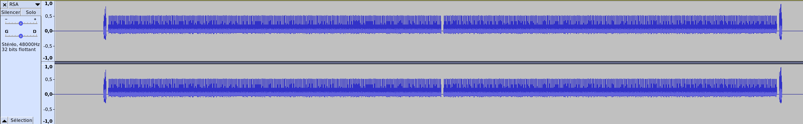
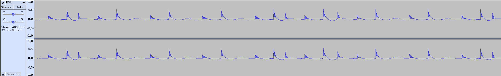

# Write-Ups for the FCSC 2021


## Write-Up - son pour analyse


### Challenge discovery

We are presented a sound file that is, according to the challenge, a recording of the processor activity during an RSA-CRT encryption. This encryption was to be protected against side-channel attacks but, apparently, it failed.


The RSA parameters are also given:

```
e = 65537
n = 114181065031786564590139505995090932681603488058093695383755920020714540043378009781380110655253006728353171921382633045444731450267353184468441566668432893992049978192406103162591416659000523363797206479008373775089128981682147631692898693610665109453356689955829711356078688003770094519986009441791800904261
```


A bit of reminder about RSA-CRT:

Let's imagine you know `N = p*q` and `d = inv(e) % (p-1)(q-1)`. You have the message encrypted  `c = pow(m, e, N)`

To ease the decryption (for devices with small computation capacities), it is possible to split the decryption in to parts, thanks to the Chinese Remainder Theorem.

Then, if `dp = d % (p-1)` and `dq = d % (q-1)` are known, it is possible to recover `m = pow(c,d, N) `by calculating `m1 = pow(m, dp, p)` and `m2 = pow(m, dq, q)`.

Here, dp and dq will be useful to recover d.


### Capture analysis

Opening the capture in Audacity gives the following footage:




It seems to have two parts, that could be linked to the calculus of the power of c by dp and dq.

By zooming a bit, we can see the following signals:




The same pattern seems to repeat itself. However, a little difference can be observed for some signals. A third peek appears. It is probably due to the additional operation done when the modular exponentiation operation is calculated with a bit equal to 1.


Starting with this hypothesis, it is possible to recover dp and dq by checking each pattern:

- If after a high peek, a small peek appears, a 1 is encountered.
- If after a high peek, no small appears, a 0 is encountered.


The recovery is given by the script.py.

The dp and dq parameters recovered are : 

```
dp = 3682973498349910010902469039424484449429687767351801810758950848760934083126881802547323971301942991054834363957603060521663932575253378274024147122084225
dq = 11207046718320863021768362070050252531094076052092140650399675758697495571031877907598475801227834183751162388307397860808085489302286055225961660310391813
```


To recover p and q, only one of dp and dq is sufficient. To do that, let's start from the formula:


```
dp = d [p-1]
e*dp = e*d = 1 [p-1]
e*dp - 1 = k(p-1)
e*dp - 1 + k = k*p
gcd(e*dp - 1 + k, N) = p
```


As `e*dp < e*p`, the answer is given by iterating over 1 < k < e.

The p found is

```
p = 9596494678807174474575187398090109627952983747174579964683101215618850866964315072103370352545143042492075370176901708707390630931312843986351802239982263
```


Now we can factor N, thus recover d and get the flag by computing the SHA256 sum of the RSA signature of the file RSA.wav :


**FCSC{0b26865188f93d030c7ffdcf4ce50a0adb9ba023988fdefa87d7b1d73c438e0e}**

