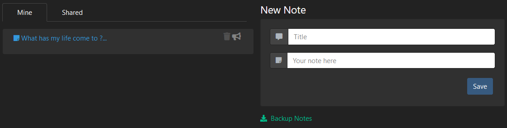
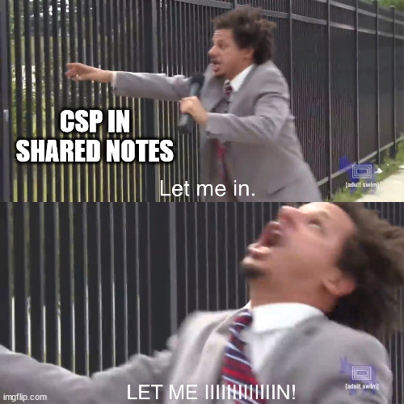
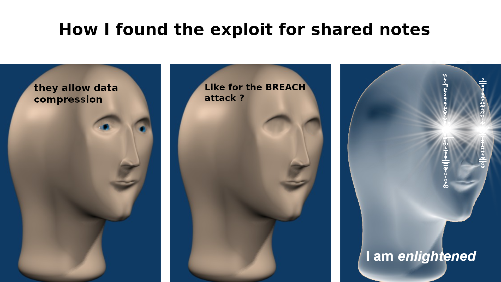
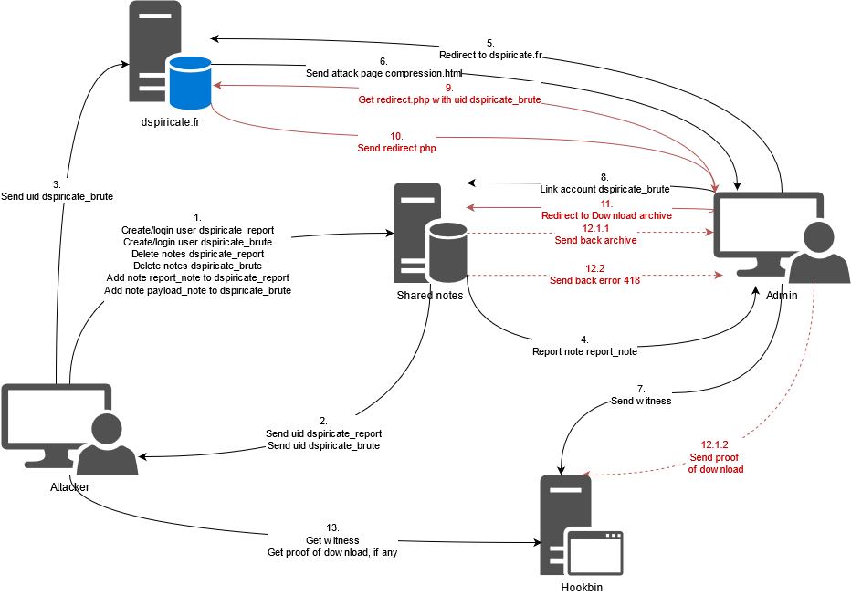
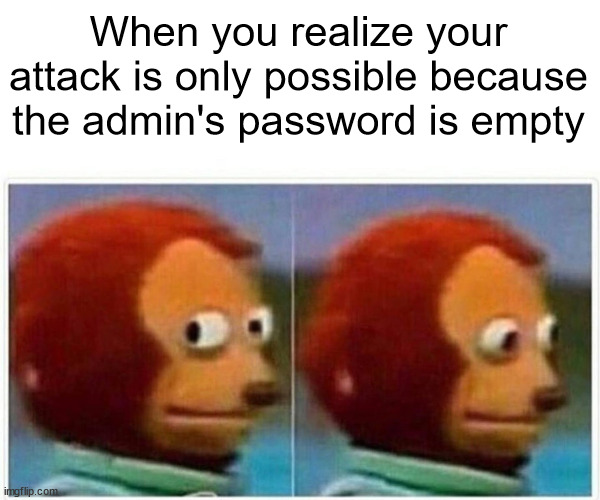

# Write-Ups for the FCSC 2021


## Write-Up - Shared Notes

### Challenge discovery

This was the first hard challenge I solved this edition. We are given a web site that can be used to store notes. A user can login/register and is identified with a very long user id. A user can also bind the notes of another account in readonly. They can also report a note to the admin that will be read by them. Finally, a user can download their notes (with the one of the linked account), but only if the archive is less than 1024 bytes.

The aim of the challenge is probably to exploit client side vulnerabilities to exfiltrate an admin's note containing the flag. 




### Information gathering

After some time discovering the application with the help of the **OWASP Web Security Testing Guide v 4.2**, I noticed the following points:

Vulnerabilities:
- HTML injection in notes, allowing an attacker to, among other things, redirect the victim to an attacker controlled page (or mess up the current page)
- No CSRF protection, allowing an attacker to force a victim to perform arbitrary actions on the application

Protections:
- Strong content security policy, preventing an attacker from injecting or loading external resources or scripts.
- No CORS policy, meaning no bypass of the Same Origin Policy can be exploited
- No other potential injections
- Downloadable archives are sent with the attachment header, making it impossible to execute them inside the  

### Find the attack

I spent a lot of hours trying to find out how to bypass the very restrictive CSP.





I could only force the admin to be redirected to https://hookb.in/OeGyR7d2n1tnzzlkeN8V with the following payload:

```html
<META http-equiv="refresh" content="0; URL=https://hookb.in/OeGyR7d2n1tnzzlkeN8V">
```

However, I was stuck. I could not find a way to exfiltrate data, because of that damned CSP.


The illumination came to me in one instant. As if all the elements merged into one single universal idea that gave me the Answer to the Ultimate Question of Life, the Universe, and Everything.





I started to think what could be done with the Export As Gzip function. I remembered that vulnerabilities on compression ratios do exist in SSL/TLS, such as the BREACH attack. They use the differences of compression ratios according to the information redundancy in the compressed data. Therefore, more redundant data are more compressed and, thus, the resulting archive is lighter.

It means that, if one can leak the size of the compressed archive for different inputs and compare them, it is possible to guess byte by byte the flag. indeed, if the flag is **FCSC{1234567890}** and is already in an admin's note, then data redundancy will be more important if one injects a note with **FCSC{1234567890}** than another with **FCSC{123456789a}**, resulting, in theory, in a lighter archive for the first case.

All I need to perform the attack is a test case, to compare sizes of generated archives, which is given by the size limit of 1023 bytes for the archives:
- If the archive size is less than 1024 bytes, it will be downloaded as an attachment
- If not, the server sends back an error 418 - I'm a teapot

I do now have the plan for the exploit:

1. Create a payload note with **FCSC{XX..Y+random garbage** where X are the bytes already found and Y the guessed byte (I will talk about the random garbage later)
2. Report a note with a redirection towards a controlled endpoint
3. Force the admin to link the account with the payload note
4. Force the admin to download an archive
5. Use the response of the server to get the size of the archive (more or less than 1023 bytes)

I still have a problem, for the attack to be feasible. I have to find a way to bypass the same origin policy to get the response code of the archive download. I quickly observed that if I redirected (with a meta refresh tag or a document.location) a window to the archive, it does not really redirect, but only downloads the archive. However, when the error 418 is thrown,  as no archive is downloaded, the window is redirected to the error page.

Using this trick, it is possible to assert whether the archive is more or less than 1023 bytes, with the following process:
1. Try an immediate redirection to the archive download
2. Try a redirection to the endpoint with a delay of ca 0.5s
3. If the archive can be downloaded, the other redireciton will be triggered
4. If not, the other redirection is not triggered.


### Finding the perfect payload

I have now all the keys to perform the attack, except the payload to add. two questions came to me:

1. What form should I use as a payload ?
2. What kind of random garbage should I use ?

For the first question, I first decided to create a unique note of the form **random garbage+FCSC{XX..Y**. But many attempts tended to show that the inverse (**FCSC{XX..Y+random garbage**) allowed better results in the stability of compression ratios (probably because the true flag and the guessed flag were closer, making it easier for the compression algorithm to find the redundancy).

For the second question, I tried several garbage forms:
1. First, classic hexadecimal randomness. This was not the most effective, probably because some parts of the flag or the guessing were present in the garbage, adding unwanted redundancy.
2. Second, base64 encoded randomness. It was quite better, but it did not solve the problem of unwanted redundancy.
3. Third, randomness based on a charset without hexadecimal characters (plus special characters of the JSON format). This was the most effective and allowed enough stability on the compression ratio to guess the flag character by character, with an sufficient entropy to maximize the impact of the redundancy of the flag.

To get the desired garbage, I use the following command:

```python
print("".join(random.choices(list("AZERTYUIOPQSDFGHJKLMWXCVBNghijklmnopqrstuvwxyz()_./?!%*$-|#~"), k=2000)))
```

With 2000 characters, I ensured the pool was big enough to create archives of more than 1023 bytes.


### Preparing the attack

I tried to see if it was possible to perform more than one test  at a time, but the bot shut the request too quickly too have an stable attack with 2 or more tests at a time.

Below is a diagram showing how to perform a single test  on the bot.





The actions in red are performed in an iframe to avoid non desired redirections.
Here are described the different actions:

1. Prepare the accounts for the payload and the report notes
2. Get the uid of the created accounts
3. Modify the attack.html file on dspiricate.fr to set the uid of the dspiricate_brute account
4. Report the report_note to admin
5. The admin will check the note and will be redirected to dspiricate.fr/compression.html
6. The compression.html page is executed by the admin
7. A first request is made towards the Hookbin to witness the admin passage
8. The compression.html page will link the dspiricate_brute account to the admin account 
9. The compression.html page will load dspiricate.fr/redirect.php inside an iframe, with dspiricate_brute uid to download the right archive
10. The redirect.php will be executed by the admin
11. The redirect.php page will try to relocate the iframe to download the archive
12. 1.  If the archive is less than 1024 bytes:
    	1. The archive is sent back
    	2. A proof is sent to the hookbin
    2.	If the archive is 1024 bytes or more:
    	1. The 418 error page is displayed
13. Get the requests sent to the hookbin and see if the proof was sent or not

ps : I figured out only during the redaction of this write-up that this attacks only works because the admin does not have any password. Indeed, in order to link the account to the admin, the password of the admin account must be provided. Here, I provided an empty one!





### Executing the attack

Before starting the flag exfiltration, I must know how many bytes of the random garbage I have to add to the payload to be in the limit of 1023 bytes. So, the first step is to send, as a payload, **FCSC{+random garbage**, with different lengths, to reach the extreme limit of downloadable archives.

Once it is done (let's call the perfect random garbage **garbage_payload**), the attack is done as follows:
- Send **FCSC{XXY+garbage_payload**.
- If Y is a good character, then redundancy is the same as **FCSC{XX+garbage_payload}** and the archive will be downloaded (as it is based on the last occurence of the string, which is the flag)
- If Y is a bad character, then redundancy is less than **FCSC{XX+garbage_payload}** (as the string will differ from the flag), adding thus more entropy, making the archive bigger. As a result, the archive will not be downloaded

As a result, the proof will be sent only when a good character of the flag was guessed.


### Getting the flag


I spent many, many, many hours (because of wrong payloads, wrong guesses, sometimes unstable bot and a lot of tireness) to get the flag, but in the end, the attack was efficient and gave the characters of the flag: **FCSC{2172bd19c0}**


